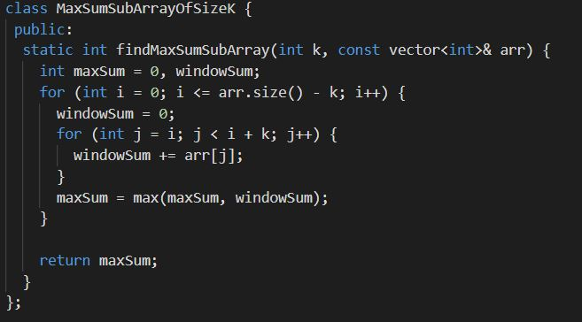

### Question Link (GFG) : https://practice.geeksforgeeks.org/problems/max-sum-subarray-of-size-k5313/1#

### Solution Video :


### Solution 1 : ( Basic brute force )

TIL : calculate the sum of all ‘k’ sized subarrays of the given array, to find the subarray with the highest sum.





### Solution 2 : ( Sliding Window )

```
class Solution{   
public:
    int maximumSumSubarray(int K, vector<int> &Arr , int N){
    int i=0,j=0,sum=0,tsum=0;
        while(j<N){
            tsum += Arr[j];
            if(j-i+1<K){
                j++;
            }else{
                sum = max(sum,tsum);
                tsum -= Arr[i];
                i++;
                j++;
            }
        }
        return sum;
    }
};
```